# Agri Telemetry & Forecasting Platform — Evidence & Validation Framework

**Status:** ACTIVE  
**Last Updated:** September 30, 2026  
**Document:** `09_evidence/VALIDATION_MATRIX.md` / `11. Evidence & Validation/Evidence & Validation - Agri Telemetry & Forecasting Platform.md`

---

## 1. Document Authority & Scientific Integrity

This document is the official ledger of empirical findings, software test outcomes, data-quality verifications, and scientific validation results for the **Agri Telemetry & Forecasting Platform**.

### Non-Negotiable Rules of Evidence:
1. **Never fabricate evidence:** No metric, test result, calibration score, or operational finding may be entered without actual code execution and verifiable data artifacts.
2. **Software Tests $\neq$ Scientific Validation:** Passing a unit or integration test confirms code implementation correctness; it does **not** validate a scientific hypothesis or agronomic threshold.
3. **Status Honesty:** Status values must reflect true empirical progress:
   - `OPEN`: Not yet evaluated.
   - `ASSUMPTION`: Believed, but lacks empirical verification.
   - `RESEARCHING`: Literature review or benchmark experiment actively running.
   - `DECIDED`: Architectural/design choice documented via ADR, awaiting build.
   - `IMPLEMENTED`: Code exists.
   - `TESTED`: Code passed programmatic test suites.
   - `VALIDATED`: Supported by rigorous, out-of-sample empirical evidence.
   - `REJECTED`: Disproven or discarded based on experimental evidence.

---

## 2. Evidence Classification Framework

The platform organizes evidence across 9 distinct tiers:

```mermaid
flowchart TD
    subgraph Software & Engineering Verification
        E1[1. Implementation Evidence] --> E2[2. Unit & Integration Test Evidence]
        E2 --> E3[3. Event-Processing & Idempotency Evidence]
        E3 --> E4[4. Reproducibility Evidence]
    end

    subgraph Data & Signal Quality
        D1[5. Data-Quality & QC Evidence] --> D2[6. Anomaly Isolation Evidence]
    end

    subgraph Scientific & Forecasting Validation
        S1[7. Forecast Evaluation Evidence] --> S2[8. Uncertainty Calibration Evidence]
        S2 --> S3[9. Threshold & Lead-Time Evidence]
    end
```



1. **Implementation Evidence:** Verifies module existence, package installability, and interface compliance.
2. **Unit & Integration Test Evidence:** Code execution assertions, boundary checks, and error handling.
3. **Event-Processing & Idempotency Evidence:** Deduplication over duplicate streams, clock-drift handling, out-of-order event routing.
4. **Reproducibility Evidence:** Deterministic replay runs with fixed seeds producing identical evaluation metrics.
5. **Data-Quality & QC Evidence:** Audit of real in-situ station data (missingness, physical bounds, sensor flatlines).
6. **Anomaly Isolation Evidence:** Proof that synthetic data-quality faults are quarantined and **never** trigger false-positive agronomic stress alerts.
7. **Forecast Evaluation Evidence:** Walk-forward out-of-sample benchmark of persistence baseline vs. alternative models (MAE, RMSE).
8. **Uncertainty Calibration Evidence:** Empirical prediction interval coverage probability (PICP) vs nominal coverage ($80\%$).
9. **Threshold & Lead-Time Evidence:** Verification of actionable warning lead time before Management Allowable Depletion (MAD) breaches.

---

## 3. Master Evidence & Validation Matrix

| Evidence ID | Claim / Question / Hypothesis | Dataset / Source | Time Period | Method / Experiment Config | Primary Metric | Target / Criterion | Actual Result | Interpretation | Status | Artefact / Test Reference | Known Limitations |
| :--- | :--- | :--- | :--- | :--- | :--- | :--- | :--- | :--- | :--- | :--- | :--- |
| **EVD-001** | Telemetry JSON schema strictly enforces required provenance and sensor units. | Synthetic test payloads | N/A | Schema validation test suite | Schema validation pass rate | 100% pass on valid; 100% fail on invalid | To be executed in initial test run | Schema contract compliance | **IMPLEMENTED** | `tests/test_schemas.py` | Schema syntax only |
| **EVD-002** | Duplicate incoming events are deduplicated idempotently without state corruption. | Injected duplicate stream | Replay | SHA256 key matching in-memory cache | Duplicate suppression rate | 100% duplicate suppression | To be executed in initial test run | Safe at-least-once ingestion | **IMPLEMENTED** | `tests/test_idempotency.py` | In-memory scope |
| **EVD-003** | Injected synthetic sensor spikes are isolated at Tier 1 and never trigger Tier 3 Agronomic Alerts. | Synthetic fault generator | Replay | Injected $0.30\text{ m}^3/\text{m}^3$ single-step spike | Alert classification rate | 0% false agronomic alerts; 100% QC flag capture | To be executed in initial test run | Strict anomaly boundary preserved | **IMPLEMENTED** | `tests/test_anomaly_isolation.py` | Synthetic fault patterns |
| **EVD-004** | Feature construction strictly prevents future-data leakage during walk-forward backtest. | Historical station data | 2024–2025 | Walk-forward timestamp assertion | Feature timestamp leakage rate | Exactly 0 leaked future timestamps | To be executed in initial test run | Temporal causality guaranteed | **IMPLEMENTED** | `tests/test_leakage.py` | In-situ point sensor |
| **EVD-005** | Persistence baseline establishes a valid benchmark for 1h to 168h soil moisture forecast. | USCRN Station records | Historical sample | Walk-forward evaluation ($h=1\dots 168\text{h}$) | Out-of-sample MAE / RMSE | Establish empirical baseline benchmark | Awaiting empirical execution run | Baseline reference for all future models | **RESEARCHING** | `agri_telemetry/forecasting/` | Station-specific soil texture |
| **EVD-006** | 80% prediction intervals achieve empirical coverage between 75% and 85% on out-of-sample test. | USCRN Station records | Historical sample | Residual quantile estimation ($q_{10}$ to $q_{90}$) | Prediction Interval Coverage (PICP) | $75\% \le \text{PICP} \le 85\%$ | Awaiting empirical execution run | Uncertainty calibration check | **RESEARCHING** | `agri_telemetry/forecasting/` | Station sample size |
| **EVD-007** | Pipeline execution produces bitwise identical results given the same config and random seed. | Replay dataset | Fixed window | Dual-run execution with seed=42 | Output diff hash | Hash match (0 byte delta) | To be executed in initial test run | Fully reproducible MLOps pipeline | **IMPLEMENTED** | `tests/test_reproducibility.py` | Local execution env |

---

## 4. Experiment & Decision Ledger

### 4.1 Experiment Registry Template
```text
Experiment ID: EXP-[YYYYMMDD]-[SEQ]
Date: YYYY-MM-DD
Investigator / Agent: Antigravity
Objective: [Specific hypothesis being tested]
Dataset Source & Version: [e.g. USCRN Lincoln 11 SW, 2024-2025 hourly]
Splitting Strategy: Chronological Walk-Forward (Train: Jan-Jun, Val: Jul-Aug, Test: Sep-Oct)
Model / Configuration: [Model class, hyperparameters, feature set]
Baseline Comparison: PersistenceBaseline
Observed Metrics:
  - MAE (h=24): [Value]
  - RMSE (h=24): [Value]
  - PICP (80% CI): [Value]
Decision / Conclusion: [ACCEPTED / REJECTED / NEEDS_FURTHER_STUDY]
Artefact Path: data/experiments/[EXP_ID]/
```

### 4.2 Status Transition Log
- **2026-09-30:** Initialized evidence framework. Schemas, contract, implementation plan, and baseline architecture defined under `DECIDED` and `IMPLEMENTED` statuses. Zero empirical claims marked as `VALIDATED` prior to verifiable test execution.
