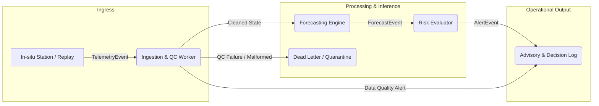
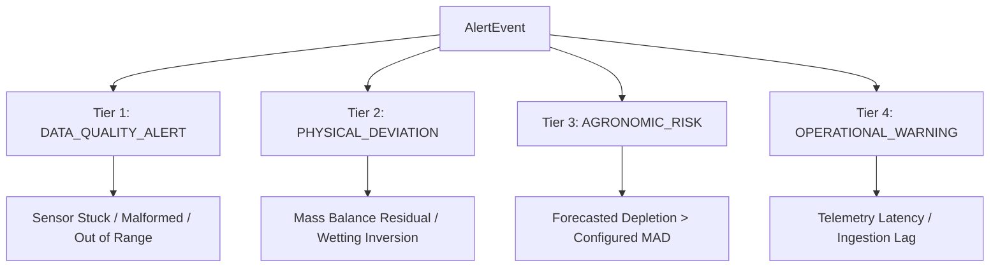

# Agri Telemetry & Forecasting Platform — Event & Telemetry Contract

**Status:** DECIDED  
**Last Updated:** September 30, 2026  
**Document:** `07_contracts/EVENT_TELEMETRY_CONTRACT.md` / `9. Event & Telemetry Contract/Event & Telemetry Contract - Agri Telemetry & Forecasting Platform.md`

---

## 1. Document Authority & Purpose

This contract establishes the canonical schema, serialization format, temporal semantics, provenance tracking, quality flags, and idempotency guarantees for all event-driven data flows across the **Agri Telemetry & Forecasting Platform**.

All components—including ingestion gateways, stream workers, persistence baselines, forecasting models, and risk evaluation engines—must strictly conform to the schemas specified herein.

### Governing Principles:
1. **Event Time $\neq$ Ingestion Time:** Event generation timestamp (`event_time`) must be preserved independently from system receipt timestamp (`ingest_time`). Chronology, feature generation, and walk-forward evaluations are governed strictly by `event_time` (**Rule #6, #8, #27**).
2. **Explicit Provenance:** Every event must explicitly declare its data origin mode (`OBSERVED`, `MODELLED_REANALYSIS`, `SIMULATED_REPLAY`, `SYNTHETIC_FAULT`) (**Rule #4, #5, #21, #28**).
3. **Strict Quality Categorization:** Quality flags are attached at ingress. Data-quality failures must never masquerade as physical dynamics or agronomic alerts (**Rule #12, #13**).
4. **Idempotent Ingestion & Deduplication:** Every event carries a canonical `event_id` (UUIDv4) and supports deterministic natural composite key evaluation (`SHA256`) to ensure duplicate delivery from client retries or network replays is suppressed without mutating state (**Rule #22, #23**).
5. **Advisory Semantics Only:** Alert events provide decision support and risk quantification. The system never executes autonomous valve/irrigation actuation.

---

## 2. Event Types & Taxonomy

The platform defines three canonical event schemas:



| Event Type | Purpose | Emission Source | Schema File |
| :--- | :--- | :--- | :--- |
| **`TelemetryEvent`** | Point-in-time sensor readings, meteorology, and soil moisture measurements with attached QC flags. | Ingestion Gateway / Simulator / Replay Worker | [`telemetry-event.schema.json`](schemas/telemetry-event.schema.json) |
| **`ForecastEvent`** | Horizon-specific soil-water trajectory predictions containing point estimates, uncertainty quantiles, and model lineage. | Forecasting Engine (Baseline / ML) | [`forecast-event.schema.json`](schemas/forecast-event.schema.json) |
| **`AlertEvent`** | Multi-tier operational warnings categorized by Data Quality, Physical Residuals, or Agronomic Threshold Risks. | QC Pipeline / Hydrological Auditor / Risk Evaluator | [`alert-event.schema.json`](schemas/alert-event.schema.json) |

---

## 3. Telemetry Event Specification

### 3.1 Field Definitions & Types

| Field | Type | Required | Description / Constraints |
| :--- | :--- | :--- | :--- |
| `schema_version` | String | Yes | Semantic version of the event schema (e.g. `"1.0.0"`). |
| `event_id` | String (UUIDv4) | Yes | Globally unique identifier for this event instance. |
| `source_id` | String | Yes | Unique identifier for physical station, logger, or simulation node (e.g. `"USCRN_NE_Lincoln_11_SW"`). |
| `site_id` | String | Yes | Agronomic management zone or field identifier (e.g. `"FIELD_ZONE_04"`). |
| `event_time` | String (ISO 8601) | Yes | UTC timestamp when the physical phenomenon was measured (`YYYY-MM-DDTHH:MM:SS.sssZ`). |
| `ingest_time` | String (ISO 8601) | Yes | UTC timestamp when the message entered the platform ingestion gateway. |
| `provenance` | Object | Yes | Provenance metadata block (see Section 3.2). |
| `measurements` | Array of Objects | Yes | Array of individual sensor readings (see Section 3.3). |
| `qc_summary` | Object | No | Quality assessment summary for the payload. |

### 3.2 Provenance Metadata Block
```json
"provenance": {
  "data_class": "OBSERVED", // Enum: OBSERVED, MODELLED_REANALYSIS, SIMULATED_REPLAY, SYNTHETIC_FAULT
  "network": "USCRN",
  "dataset_version": "2026.09.v1",
  "replay_session_id": "REPLAY_20260930_001", // null for real-time
  "synthetic_fault_type": null // Enum: "VALUE_SPIKE", "SENSOR_STUCK", "CLOCK_DRIFT", "PACKET_DROP", "NON_PHYSICAL_RANGE", or null
}
```

### 3.3 Measurements Array
Each entry in `measurements` defines:
- `sensor_id`: string identifier (e.g. `"SOIL_VW_10CM"`).
- `variable_name`: standard variable name from registry:
  - `volumetric_water_content` ($\text{m}^3/\text{m}^3$)
  - `soil_temperature` ($^\circ\text{C}$)
  - `air_temperature` ($^\circ\text{C}$)
  - `relative_humidity` ($\%$)
  - `precipitation` ($\text{mm}$)
  - `solar_radiation` ($\text{W}/\text{m}^2$)
  - `wind_speed` ($\text{m}/\text{s}$)
  - `atmospheric_pressure` ($\text{kPa}$)
  - `vapor_pressure_deficit` ($\text{kPa}$)
- `depth_cm`: numeric sensor burial depth below soil surface ($0.0$ for atmospheric sensors).
- `value`: numeric measurement value, or `null` if sensor reading is missing.
- `unit`: standard SI/agronomic unit string (`"m3/m3"`, `"degC"`, `"mm"`, `"W/m2"`, `"m/s"`, `"kPa"`, `"percent"`, `"fraction"`).
- `qc_flag`: quality label (`"VALID"`, `"SUSPECT_SPIKE"`, `"SUSPECT_STUCK"`, `"OUT_OF_RANGE"`, `"MISSING"`, `"SYNTHETIC_CORRUPTED"`).

---

## 4. Forecast Event Specification

### 4.1 Field Definitions

| Field | Type | Required | Description |
| :--- | :--- | :--- | :--- |
| `schema_version` | String | Yes | `"1.0.0"` |
| `forecast_id` | String (UUIDv4) | Yes | Unique ID for the forecast run. |
| `source_id` | String | Yes | Associated station or monitoring node. |
| `site_id` | String | Yes | Associated field / agronomic management zone. |
| `forecast_origin_time` | String (ISO 8601) | Yes | The cutoff time $t$ representing the latest available telemetry used for this forecast. Strictly no telemetry where $t_{\text{event}} > t_{\text{origin}}$ was visible during model generation. |
| `generated_at` | String (ISO 8601) | Yes | Execution timestamp of the inference run. |
| `target_variable` | String | Yes | Forecast target (`"volumetric_water_content"`, `"root_zone_depletion_fraction"`, `"fraction_of_available_water"`, `"root_zone_storage_mm"`). |
| `target_depth_range_cm` | Array of Number | No | `[min_depth, max_depth]`, e.g. `[0.0, 40.0]`. |
| `model_metadata` | Object | Yes | Lineage metadata (see Section 4.2). |
| `predictions` | Array of Objects | Yes | Horizon steps $h_1, h_2, \dots, h_n$ (see Section 4.3). |

### 4.2 Model Metadata Block
```json
"model_metadata": {
  "model_name": "PERSISTENCE_BASELINE", // e.g. "PERSISTENCE_BASELINE", "ARIMA_CONDITIONAL", "HIST_GRADIENT_BOOST"
  "model_version": "0.1.0",
  "training_cutoff_time": "2026-09-01T00:00:00Z",
  "random_seed": 42,
  "feature_lineage": [
    {"source_id": "USCRN_NE_Lincoln_11_SW", "variable": "volumetric_water_content", "lag_steps": [0, 1, 24]}
  ]
}
```

### 4.3 Predictions Array (Quantile & Uncertainty Representation)
Each prediction entry corresponds to a discrete horizon step:
```json
{
  "horizon_hours": 24,
  "valid_time": "2026-10-01T12:00:00Z",
  "point_forecast": 0.385,
  "quantiles": {
    "q10": 0.352,
    "q25": 0.370,
    "q50": 0.385,
    "q75": 0.401,
    "q90": 0.424
  },
  "prediction_interval_80": {
    "lower": 0.352,
    "upper": 0.424
  },
  "unit": "fraction"
}
```

---

## 5. Alert & Risk Event Specification

### 5.1 Three-Tier Anomaly & Alert Boundary (Strict Separation)

The platform enforces a rigid taxonomy across alert categories:



1. **`DATA_QUALITY_ALERT` (Tier 1):**
   - Corrupted payloads, hardware timeouts, flatlining/frozen sensors, non-physical spikes.
   - *Policy:* Handled by infrastructure/data-ops. **Never triggers crop stress or irrigation alerts.**
2. **`PHYSICAL_DEVIATION` (Tier 2):**
   - Statistically significant deviation between physical mass-balance model and observed in-situ response (e.g. unexplained infiltration without rain record).
   - *Policy:* Logged for hydrological diagnosis. **Never converted into crop stress without phenological context.**
3. **`AGRONOMIC_RISK` (Tier 3):**
   - Predicted soil water depletion exceeding site-specific Management Allowable Depletion (MAD) threshold within decision horizon.
   - *Policy:* Generates farmer/agronomist advisory with probability metrics. **No autonomous actuation.**
4. **`OPERATIONAL_WARNING` (Tier 4):**
   - Communication latency, missing scheduled packets, batch replay anomalies.

### 5.2 Alert Event Payload Structure
```json
{
  "$schema": "https://agri-telemetry.io/schemas/alert-event.schema.json",
  "schema_version": "1.0.0",
  "alert_id": "8f3b2d10-e4b9-4d6a-932b-8a2b5e6f7c8d",
  "category": "AGRONOMIC_RISK", // Enum: DATA_QUALITY_ALERT, PHYSICAL_DEVIATION, AGRONOMIC_RISK, OPERATIONAL_WARNING
  "severity": "WARNING", // Enum: INFO, WARNING, CRITICAL
  "source_id": "USCRN_NE_Lincoln_11_SW",
  "site_id": "FIELD_ZONE_04",
  "trigger_time": "2026-10-01T12:00:00Z",
  "trigger_condition": {
    "threshold_type": "MANAGEMENT_ALLOWABLE_DEPLETION",
    "threshold_value": 0.50,
    "threshold_unit": "fraction",
    "forecast_horizon_hours": 48,
    "exceedance_probability": 0.88,
    "predicted_value": 0.54
  },
  "context": {
    "crop_type": "Maize",
    "growth_stage": "Tasseling / Silking",
    "current_depletion_fraction": 0.42,
    "forecast_model_id": "PERSISTENCE_BASELINE_v0.1.0"
  },
  "actionable_guidance": "Depletion forecasted to exceed MAD (50%) in 48 hours with 88% confidence. Review irrigation scheduling window.",
  "is_autonomous_actuation": false
}
```

---

## 6. Identity & Idempotency Semantics

1. **Application Event Identity:** The canonical identifier of any event instance is its top-level `event_id` (UUIDv4).
2. **Deduplication Key Derivation:** To suppress duplicate delivery across client retries or network replays, consumers compute:
   $$\text{IdempotencyKey} = \text{SHA256}(\text{source\_id} \mathbin{\Vert} \text{event\_time} \mathbin{\Vert} \text{data\_class} \mathbin{\Vert} \text{schema\_version})$$
3. **Out-of-Order Handling:** Events with `ingest_time - event_time > tolerance_window` update historical state indexing without corrupting the active forecast origin cache.
