# Agri Telemetry & Forecasting Platform — Evidence & Validation Framework

**Status:** ACTIVE  
**Last Updated:** October 1, 2026  
**Document:** `Evidence & Validation/Evidence & Validation - Agri Telemetry & Forecasting Platform.md`

---

## 1. Document Authority & Scientific Integrity

This document is the official ledger of empirical findings, software test outcomes, data-quality verifications, and scientific validation results for the **Agri Telemetry & Forecasting Platform**.

### Non-Negotiable Rules of Evidence:
1. **Never fabricate evidence:** No metric, test result, calibration score, or operational finding may be entered without actual code execution and verifiable data artifacts.
2. **Software Tests $\neq$ Scientific Validation:** Passing a unit or integration test confirms code implementation correctness; it does **not** validate a scientific hypothesis or agronomic threshold.
3. **Status Honesty:** Status values must reflect true empirical progress:
   - `OPEN`: Not yet evaluated.
   - `ASSUMPTION`: Believed, but lacks empirical verification.
   - `RESEARCHING`: Literature review or benchmark experiment actively running.
   - `DECIDED`: Architectural/design choice documented via ADR, awaiting build.
   - `IMPLEMENTED`: Code exists.
   - `TESTED`: Code passed programmatic test suites.
   - `VALIDATED`: Supported by rigorous, out-of-sample empirical evidence.
   - `REJECTED`: Disproven or discarded based on experimental evidence.

---

## 2. Evidence Classification Framework

The platform organizes evidence across 9 distinct tiers:

```mermaid
flowchart TD
    subgraph Software & Engineering Verification
        E1["1. Implementation Evidence"] --> E2["2. Unit & Integration Test Evidence"]
        E2 --> E3["3. Event-Processing & Idempotency Evidence"]
        E3 --> E4["4. Reproducibility Evidence"]
    end

    subgraph Data & Signal Quality
        D1["5. Data-Quality & QC Evidence"] --> D2["6. Anomaly Isolation Evidence"]
    end

    subgraph Scientific & Forecasting Validation
        S1["7. Forecast Evaluation Evidence"] --> S2["8. Uncertainty Calibration Evidence"]
        S2 --> S3["9. Threshold & Lead-Time Evidence"]
    end
```



1. **Implementation Evidence:** Verifies module existence, package installability, and interface compliance.
2. **Unit & Integration Test Evidence:** Code execution assertions, boundary checks, and error handling.
3. **Event-Processing & Idempotency Evidence:** Deduplication over duplicate streams, clock-drift handling, out-of-order event routing.
4. **Reproducibility Evidence:** Deterministic replay runs with fixed seeds producing identical evaluation metrics.
5. **Data-Quality & QC Evidence:** Audit of real in-situ station data (missingness, physical bounds, sensor flatlines).
6. **Anomaly Isolation Evidence:** Proof that synthetic data-quality faults are quarantined and **never** trigger false-positive agronomic stress alerts.
7. **Forecast Evaluation Evidence:** Walk-forward out-of-sample benchmark of persistence baseline vs. alternative models (MAE, RMSE).
8. **Uncertainty Calibration Evidence:** Empirical prediction interval coverage probability (PICP) vs nominal coverage ($80\%$).
9. **Threshold & Lead-Time Evidence:** Verification of actionable warning lead time before Management Allowable Depletion (MAD) breaches.

---

## 3. Master Evidence & Validation Matrix

| Evidence ID | Claim / Question / Hypothesis | Dataset / Source | Time Period | Method / Experiment Config | Primary Metric | Target / Criterion | Actual Result | Interpretation | Status | Artefact / Test Reference | Known Limitations |
| :--- | :--- | :--- | :--- | :--- | :--- | :--- | :--- | :--- | :--- | :--- | :--- |
| **EVD-001** | Telemetry JSON schema strictly enforces required provenance and sensor units. | Synthetic & Real USCRN payloads | 2023 | Schema validation test suite (Draft 2020-12) | Schema validation pass rate | 100% pass on valid; 100% fail on invalid | **100% Passed** (4/4 test cases) | Schema contract compliance confirmed | **TESTED** | `tests/test_contracts.py` | Schema syntax & types |
| **EVD-002** | Duplicate incoming events are deduplicated idempotently without state corruption. | Injected duplicate stream | Replay | SHA256 natural key matching in SQLite | Duplicate suppression rate | 100% duplicate suppression | **100% Suppressed** (Duplicate rejected, count=1) | Safe at-least-once ingestion | **TESTED** | `tests/test_idempotency.py` | Single SQLite database |
| **EVD-003** | Injected synthetic sensor spikes/flatlines are isolated at Tier 1 and never trigger Tier 3 Agronomic Alerts. | Synthetic fault generator + USCRN | 2023 | Injected $0.35\text{ m}^3/\text{m}^3$ spike & unphysical bounds | Alert isolation rate | 0% false agronomic alerts; 100% QC flag capture | **0 False Agronomic Alerts**; 100% quarantined | Strict anomaly boundary preserved | **TESTED** | `tests/test_tier1_qc.py`, `tests/test_risk_evaluation.py` | Synthetic fault patterns |
| **EVD-004** | Feature construction strictly prevents future-data leakage during walk-forward backtest. | USCRN Station records | 2023 | Walk-forward timestamp split assertion | Feature timestamp leakage rate | Exactly 0 leaked future timestamps | **0 Leaked Timestamps** (Cutoff verified) | Temporal causality guaranteed | **TESTED** | `tests/test_leakage.py` | In-situ point sensor |
| **EVD-005** | Persistence baseline establishes an empirical benchmark for 1h to 168h soil moisture forecast. | USCRN Lincoln 11 SW | 2023 (8,760h) | Chronological Walk-Forward ($h=1\dots 168\text{h}$) | Out-of-sample MAE / RMSE | Establish empirical baseline benchmark | **MAE: 0.0007 (1h) to 0.0192 (168h)**; Skill: +0.998 to +0.742 | Persistence benchmark established on real data | **TESTED** | `runs/RUN-20261001-152227-10fc74/` | 1-year single station |
| **EVD-006** | 80% prediction intervals achieve calibrated coverage across out-of-sample lead times. | USCRN Lincoln 11 SW | 2023 (8,760h) | Residual quantile estimation ($q_{10}$ to $q_{90}$) | Prediction Interval Coverage (PICP) | Nominal 80% coverage | **1h: 85.5%, 6h: 81.9%, 12h: 82.3%, 24h: 72.7%** | Calibrated up to 12h; spread under-estimated at 168h | **TESTED** | `runs/RUN-20261001-152227-10fc74/` | Empirical residual quantiles |
| **EVD-007** | Pipeline execution produces deterministic, verifiable outputs with stored run evidence. | USCRN Lincoln 11 SW | 2023 | End-to-end pipeline run with fixed seed | Summary ledger & database match | Complete end-to-end execution | **8,760 records ingested, 3,913 forecasts emitted, 0 crashes** | Minimum vertical slice reproducible | **TESTED** | `tests/test_end_to_end.py` | Python runtime environment |

---

## 4. Empirical Data Quality & Ingestion Audit

### USCRN Station: `NE_Lincoln_11_SW` (WBAN 94996) — Year 2023
- **Observation Range**: `2023-01-01T01:00:00+00:00` to `2024-01-01T00:00:00+00:00`
- **Total Ingested Records**: `8,760`
- **Expected Hourly Steps**: `8,760`
- **Missing Cadence Steps**: `0` (0.00% cadence loss)
- **Duplicate Timestamps**: `0`

| Variable | Valid Records | Missing / Null | Null % | Min | Max | Mean ± Std |
| :--- | :--- | :--- | :--- | :--- | :--- | :--- |
| `air_temp_c` | 8,756 | 4 | 0.0% | -17.100 | 39.000 | 11.92 ± 11.48 |
| `precip_mm` | 8,760 | 0 | 0.0% | 0.000 | 59.000 | 0.07 ± 0.99 |
| `rh_percent` | 3,054 | 5,706 | 65.1% | 2.000 | 99.000 | 65.92 ± 20.47 |
| `soil_moisture_5cm` | 7,852 | 908 | 10.4% | 0.111 | 0.394 | 0.21 ± 0.07 |
| `soil_moisture_10cm` | 8,348 | 412 | 4.7% | 0.150 | 0.469 | 0.24 ± 0.07 |
| `soil_moisture_20cm` | 8,507 | 253 | 2.9% | 0.119 | 0.343 | 0.20 ± 0.07 |
| `soil_moisture_50cm` | 8,691 | 69 | 0.8% | 0.127 | 0.319 | 0.19 ± 0.05 |
| `soil_moisture_100cm` | 8,756 | 4 | 0.0% | 0.179 | 0.298 | 0.21 ± 0.03 |
| `soil_temp_5cm` | 8,756 | 4 | 0.0% | -5.200 | 33.100 | 12.35 ± 9.45 |
| `soil_temp_10cm` | 8,756 | 4 | 0.0% | -1.900 | 27.600 | 12.29 ± 8.50 |
| `soil_temp_20cm` | 8,756 | 4 | 0.0% | -1.000 | 26.600 | 12.44 ± 8.21 |
| `soil_temp_50cm` | 8,756 | 4 | 0.0% | 0.100 | 24.900 | 12.36 ± 7.67 |
| `soil_temp_100cm` | 8,756 | 4 | 0.0% | 1.700 | 22.700 | 12.15 ± 6.80 |
| `solar_rad_wm2` | 8,760 | 0 | 0.0% | 0.000 | 975.000 | 176.16 ± 264.28 |

---

## 5. Empirical Out-of-Sample Verification: Persistence Benchmark

### Execution Run: `RUN-20261001-152227-10fc74`
- **Target Variable**: `volumetric_water_content` ($\theta_{\text{rz}}$ over 100cm depth)
- **Model**: `PERSISTENCE_BASELINE` ($v1.0.0$, $\hat{Y}_{t+h|t} = Y_t$)
- **Splitting Strategy**: 50% chronological calibration / 50% out-of-sample test

| Horizon ($h$) | Test Samples ($N$) | MAE ($\text{m}^3/\text{m}^3$) | RMSE ($\text{m}^3/\text{m}^3$) | MBE ($\text{m}^3/\text{m}^3$) | 80% PI Coverage | Skill vs Climatology |
| :--- | :--- | :--- | :--- | :--- | :--- | :--- |
| **1h** | 3,912 | 0.0007 | 0.0024 | +0.0000 | 85.5% | +0.998 |
| **6h** | 3,907 | 0.0018 | 0.0065 | +0.0000 | 81.9% | +0.986 |
| **12h** | 3,901 | 0.0028 | 0.0091 | +0.0001 | 82.3% | +0.972 |
| **24h** | 3,889 | 0.0047 | 0.0123 | +0.0002 | 72.7% | +0.950 |
| **48h** | 3,865 | 0.0079 | 0.0166 | +0.0004 | 69.8% | +0.909 |
| **72h** | 3,841 | 0.0109 | 0.0198 | +0.0006 | 68.6% | +0.870 |
| **168h (7d)** | 3,745 | 0.0192 | 0.0283 | +0.0014 | 60.9% | +0.742 |

---

## 6. Experiment & Decision Ledger

### 6.1 Experiment Registry: EXP-20261001-001
```text
Experiment ID: EXP-20261001-001
Date: 2026-10-01
Investigator: Antigravity
Objective: Execute Phase 1 Minimum Reproducible Vertical Slice on real USCRN historical hourly data.
Dataset Source & Version: USCRN CRNH0203 (NE_Lincoln_11_SW, 2023 hourly, WBAN 94996)
Splitting Strategy: Chronological Walk-Forward (Train/Calibration: Jan 1 - Jul 2, Test: Jul 2 - Dec 31)
Model / Configuration: PERSISTENCE_BASELINE (Y_hat_{t+h|t} = Y_t) with empirical residual quantiles.
Observed Metrics:
  - MAE (1h): 0.0007 m3/m3 | RMSE (1h): 0.0024 m3/m3 | 80% PICP: 85.5%
  - MAE (24h): 0.0047 m3/m3 | RMSE (24h): 0.0123 m3/m3 | 80% PICP: 72.7%
  - MAE (168h): 0.0192 m3/m3 | RMSE (168h): 0.0283 m3/m3 | 80% PICP: 60.9%
  - Skill Score vs Mean: +0.998 (1h), +0.950 (24h), +0.742 (168h)
Decision / Conclusion: ACCEPTED as the mandatory empirical benchmark baseline for Phase 1.
Artefact Path: runs/RUN-20261001-152227-10fc74/summary.json
```

### 6.2 Status Transition Log
- **2026-09-30:** Initialized evidence framework. Schemas, contract, implementation plan, and baseline architecture defined under `DECIDED` and `IMPLEMENTED` statuses. Zero empirical claims marked as `VALIDATED` prior to verifiable test execution.
- **2026-10-01:** Executed Phase 1 Minimum Reproducible Vertical Slice on real 2023 USCRN telemetry. Verified 28 unit/integration tests (`TESTED`), completed comprehensive data audit on 8,760 hourly records, and recorded empirical persistence benchmark metrics in the master matrix.
