# Agri Telemetry & Forecasting Platform — Evidence & Validation Framework

**Status:** ACTIVE  
**Last Updated:** October 2, 2026  
**Document:** `Evidence & Validation/Evidence & Validation - Agri Telemetry & Forecasting Platform.md`

---

## 1. Document Authority & Scientific Integrity

This document is the official ledger of empirical findings, software test outcomes, data-quality verifications, and scientific validation results for the **Agri Telemetry & Forecasting Platform**.

### Non-Negotiable Rules of Evidence:
1. **Never fabricate evidence:** No metric, test result, calibration score, or operational finding may be entered without actual code execution and verifiable data artifacts.
2. **Software Tests $\neq$ Scientific Validation:** Passing a unit or integration test confirms code implementation correctness; it does **not** validate a scientific hypothesis or agronomic threshold.
3. **Status Honesty:** Status values must reflect true empirical progress:
   - `OPEN`: Not yet evaluated.
   - `ASSUMPTION`: Believed, but lacks empirical verification.
   - `RESEARCHING`: Literature review or benchmark experiment actively running.
   - `DECIDED`: Architectural/design choice documented via ADR, awaiting build.
   - `IMPLEMENTED`: Code exists.
   - `TESTED`: Code passed programmatic test suites.
   - `VALIDATED`: Supported by rigorous, out-of-sample empirical evidence.
   - `REJECTED`: Disproven or discarded based on experimental evidence.

---

## 2. Evidence Classification Framework

The platform organizes evidence across 9 distinct tiers:

```mermaid
flowchart TD
    subgraph Software & Engineering Verification
        E1["1. Implementation Evidence"] --> E2["2. Unit & Integration Test Evidence"]
        E2 --> E3["3. Event-Processing & Idempotency Evidence"]
        E3 --> E4["4. Reproducibility Evidence"]
    end

    subgraph Data & Signal Quality
        D1["5. Data-Quality & QC Evidence"] --> D2["6. Anomaly Isolation Evidence"]
    end

    subgraph Scientific & Forecasting Validation
        S1["7. Forecast Evaluation Evidence"] --> S2["8. Uncertainty Calibration Evidence"]
        S2 --> S3["9. Threshold & Lead-Time Evidence"]
    end
```



---

## 3. Authoritative Test Suite Verification (28 Tests Across 9 Modules)

Authoritative pytest execution report (`python -m pytest -v`): **28 passed in 40.35s**.

| Test File | Test Item / Case | Scope & Assertion | Status |
| :--- | :--- | :--- | :--- |
| `tests/test_contracts.py` | `test_telemetry_event_valid` | Draft 2020-12 schema validation on canonical TelemetryEvent | **PASSED** |
| `tests/test_contracts.py` | `test_forecast_event_valid` | Draft 2020-12 schema validation on ForecastEvent with quantiles | **PASSED** |
| `tests/test_contracts.py` | `test_alert_event_valid` | Draft 2020-12 schema validation on AlertEvent (`is_autonomous_actuation: false`) | **PASSED** |
| `tests/test_contracts.py` | `test_schema_rejection_on_invalid_data` | Negative test asserting explicit rejection of missing fields / actuation flag | **PASSED** |
| `tests/test_idempotency.py` | `test_sqlite_telemetry_deduplication` | SQLite deduplication: duplicate natural keys safely ignored without mutation | **PASSED** |
| `tests/test_leakage.py` | `test_walk_forward_leak_free_split` | Strict chronological walk-forward boundary: exactly 0 future timestamps leaked | **PASSED** |
| `tests/test_persistence.py` | `test_persistence_model_predictions` | Point forecast correctness: $\hat{Y}_{t+h\|t} = Y_t$ for all horizons | **PASSED** |
| `tests/test_persistence.py` | `test_uncertainty_calibrator_quantiles` | Empirical residual quantiles $q_{10} < q_{50} < q_{90}$ and bounded intervals | **PASSED** |
| `tests/test_persistence.py` | `test_walk_forward_evaluator` | Chronological backtest metrics (MAE, RMSE, MBE, Coverage, Skill) | **PASSED** |
| `tests/test_persistence.py` | `test_forecasting_engine_and_contract_validation` | `ForecastingEngine` emits contract-compliant `ForecastEvent` instances | **PASSED** |
| `tests/test_risk_evaluation.py` | `test_no_alert_when_moisture_adequate` | Zero false alerts when depletion $D_r < D_{\text{MAD}}$ | **PASSED** |
| `tests/test_risk_evaluation.py` | `test_real_time_mad_breach` | Correct `WARNING` alert emission when $D_r \ge D_{\text{MAD}}$ ($0.50$) | **PASSED** |
| `tests/test_risk_evaluation.py` | `test_critical_wilting_proximity_alert` | Correct `CRITICAL` alert emission when $D_r \ge 0.85$ | **PASSED** |
| `tests/test_risk_evaluation.py` | `test_quarantined_state_isolation` | Quarantined states strictly produce 0 agronomic alerts | **PASSED** |
| `tests/test_risk_evaluation.py` | `test_probabilistic_forward_forecast_alert` | Probabilistic threshold crossing: triggers early advisory when $P(D_r \ge D_{\text{MAD}}) \ge \tau_{\text{risk}}$ | **PASSED** |
| `tests/test_state_builder.py` | `test_soil_profile_config` | Validates soil hydraulic parameters ($\theta_{\text{FC}}, \theta_{\text{WP}}, \theta_{\text{SAT}}, TAW_{\text{mm}}$) | **PASSED** |
| `tests/test_state_builder.py` | `test_depth_integration` | Multi-depth layer thickness weighting and partial-layer renormalization | **PASSED** |
| `tests/test_state_builder.py` | `test_depletion_and_storage_metrics` | Formulations for $D_r$, $FAW$, storage (mm), and deficit (mm) | **PASSED** |
| `tests/test_state_builder.py` | `test_state_builder_from_telemetry_event` | End-to-end `SoilWaterState` object creation from valid `TelemetryEvent` | **PASSED** |
| `tests/test_tier1_qc.py` | `test_physical_range_bounds` | Rejection of values outside physical boundaries (e.g. VWC $> 0.60$) | **PASSED** |
| `tests/test_tier1_qc.py` | `test_vwc_spike_detection` | Rate-of-change filter: $|\Delta VWC| > 0.15\text{ /hr}$ without rain flagged as spike | **PASSED** |
| `tests/test_tier1_qc.py` | `test_stuck_sensor_detection` | Flatline filter: $\ge 12\text{h}$ invariant value on dynamic channels flagged | **PASSED** |
| `tests/test_tier1_qc.py` | `test_qc_engine_processing_and_quarantine` | Quarantine buffer captures corrupt payloads and emits `DATA_QUALITY_ALERT` | **PASSED** |
| `tests/test_uscrn_ingestion.py` | `test_uscrn_parser_file_exists` | Verifies real USCRN dataset cache presence in `data/uscrn/` | **PASSED** |
| `tests/test_uscrn_ingestion.py` | `test_uscrn_parser_load` | Fixed-width parser loads 8,760 hourly records into typed DataFrame | **PASSED** |
| `tests/test_uscrn_ingestion.py` | `test_uscrn_data_audit` | Ingestion audit calculations (cadence, duplicate, min/max/mean/std) | **PASSED** |
| `tests/test_uscrn_ingestion.py` | `test_uscrn_normalization_and_schema_validation` | Normalizer emits valid `TelemetryEvent` stream matching Draft 2020-12 | **PASSED** |
| `tests/test_end_to_end.py` | `test_phase1_pipeline_end_to_end` | Complete execution slice: ingestion $\to$ QC $\to$ state $\to$ forecast $\to$ risk $\to$ store $\to$ ledger | **PASSED** |

---

## 4. Master Evidence & Validation Matrix

| Evidence ID | Claim / Question / Hypothesis | Dataset / Source | Time Period | Method / Experiment Config | Primary Metric | Target / Criterion | Actual Result | Interpretation | Status | Artefact / Test Reference | Known Limitations |
| :--- | :--- | :--- | :--- | :--- | :--- | :--- | :--- | :--- | :--- | :--- | :--- |
| **EVD-001** | Telemetry JSON schema strictly enforces required provenance and sensor units. | Synthetic & Real USCRN payloads | 2023 | Schema validation test suite (Draft 2020-12) | Schema validation pass rate | 100% pass on valid; 100% fail on invalid | **100% Passed** (4/4 test cases) | Schema contract compliance confirmed | **TESTED** | `tests/test_contracts.py` | Schema syntax & types |
| **EVD-002** | Duplicate incoming events are deduplicated idempotently without state corruption. | Injected duplicate stream | Replay | SHA256 natural key matching in SQLite | Duplicate suppression rate | 100% duplicate suppression | **100% Suppressed** (Duplicate rejected, count=1) | Safe at-least-once ingestion | **TESTED** | `tests/test_idempotency.py` | Single SQLite database |
| **EVD-003** | Injected synthetic sensor spikes/flatlines are isolated at Tier 1 and never trigger Tier 3 Agronomic Alerts. | Synthetic fault generator + USCRN | 2023 | Injected $0.35\text{ m}^3/\text{m}^3$ spike & unphysical bounds | Alert isolation rate | 0% false agronomic alerts; 100% QC flag capture | **0 False Agronomic Alerts**; 100% quarantined | Strict anomaly boundary preserved | **TESTED** | `tests/test_tier1_qc.py`, `tests/test_risk_evaluation.py` | Synthetic fault patterns |
| **EVD-004** | Feature construction strictly prevents future-data leakage during walk-forward backtest. | USCRN Station records | 2023 | Walk-forward timestamp split assertion | Feature timestamp leakage rate | Exactly 0 leaked future timestamps | **0 Leaked Timestamps** (Cutoff verified) | Temporal causality guaranteed | **TESTED** | `tests/test_leakage.py` | In-situ point sensor |
| **EVD-005** | Persistence baseline establishes an empirical benchmark for 1h to 168h soil moisture forecast. | USCRN Lincoln 11 SW | 2023 (8,760h) | Chronological Walk-Forward ($h=1\dots 168\text{h}$) | Out-of-sample MAE / RMSE | Establish empirical baseline benchmark | **MAE: 0.0007 (1h) to 0.0192 (168h)**; Skill vs Climatology: +0.998 to +0.742 | Persistence benchmark established on real data | **TESTED** | `runs/RUN-20261001-152227-10fc74/` | 1-year single station |
| **EVD-006** | 80% prediction intervals achieve empirical coverage across out-of-sample lead times. | USCRN Lincoln 11 SW | 2023 (8,760h) | Residual quantile estimation ($q_{10}$ to $q_{90}$) | Prediction Interval Coverage (PICP) | Nominal 80% coverage | **1h: 85.5%, 6h: 81.9%, 12h: 82.3%, 24h: 72.7%, 168h: 60.9%** | Well-calibrated up to 12h; degrades at 7d due to summer drying variance | **TESTED** | `runs/RUN-20261001-152227-10fc74/` | Empirical residual quantiles |
| **EVD-007** | Pipeline execution produces deterministic, verifiable outputs with stored run evidence. | USCRN Lincoln 11 SW | 2023 | End-to-end pipeline run with fixed seed | Summary ledger & database match | Complete end-to-end execution | **8,760 records ingested, 3,913 forecasts emitted, 0 crashes** | Minimum vertical slice reproducible | **TESTED** | `tests/test_end_to_end.py` | Python runtime environment |

---

## 5. Comprehensive 4-Tier Data Completeness Audit

### Station Profile: USCRN `NE_Lincoln_11_SW` (WBAN 94996) — Full Calendar Year 2023
- **Temporal Range**: `2023-01-01T01:00:00Z` to `2024-01-01T00:00:00Z`

### Tier A: Temporal Cadence Completeness
- **Expected Hourly Time Steps**: `8,760`
- **Ingested Hourly Records**: `8,760`
- **Missing Cadence Slots**: `0` (**100.0%** temporal record continuity)
- **Duplicate Timestamps**: `0`

### Tier B: Meteorological & Atmospheric Instrument Availability
| Variable | Valid (Non-Null) Records | Missing / Null | Availability % | Value Range | Mean ± Std |
| :--- | :--- | :--- | :--- | :--- | :--- |
| Precipitation (`precip_mm`) | 8,760 | 0 | **100.0%** | [0.0, 59.0] mm | 0.07 ± 0.99 mm |
| Solar Radiation (`solar_rad_wm2`) | 8,760 | 0 | **100.0%** | [0.0, 975.0] W/m² | 176.16 ± 264.28 W/m² |
| Air Temperature (`air_temp_c`) | 8,756 | 4 | **99.95%** | [-17.1, 39.0] °C | 11.92 ± 11.48 °C |
| Relative Humidity (`rh_percent`) | 3,054 | 5,706 | **34.86%** *(65.14% missing)* | [2.0, 99.0] % | 65.92 ± 20.47 % |

> [!NOTE]
> Relative humidity sensor data was uninstalled/unrecorded for 5,706 hours during 2023 at this specific station. Core soil moisture and precipitation channels remained operational.

### Tier C: Depth-Specific Soil Moisture & Soil Temperature Availability
| Measurement Depth | VWC Valid Records | VWC Missing | VWC Availability % | Soil Temp Valid | Soil Temp Missing | Soil Temp Availability % |
| :--- | :--- | :--- | :--- | :--- | :--- | :--- |
| **5 cm Depth** | 7,852 | 908 | **89.63%** | 8,756 | 4 | **99.95%** |
| **10 cm Depth** | 8,348 | 412 | **95.30%** | 8,756 | 4 | **99.95%** |
| **20 cm Depth** | 8,507 | 253 | **97.11%** | 8,756 | 4 | **99.95%** |
| **50 cm Depth** | 8,691 | 69 | **99.21%** | 8,756 | 4 | **99.95%** |
| **100 cm Depth** | 8,756 | 4 | **99.95%** | 8,756 | 4 | **99.95%** |

> [!NOTE]
> Topsoil moisture (5cm and 10cm) experienced ~908 hours of missing/quarantined data primarily during January–February winter soil freezing (soil temperatures down to $-5.2^\circ\text{C}$), where dielectric permittivity readings become non-representative of liquid water content.

### Tier D: Ingress QC & Soil-Water State Construction
- **Total Ingested Events**: `8,760`
- **Quarantined Records (Isolated at Tier 1)**: `880` (10.05%)
- **Valid Root-Zone States Constructed ($\theta_{\text{rz}}$ reliable)**: `7,826` (**89.34%** of year)
- **Out-of-Sample Evaluation Records (H2 test split)**: `3,913` valid state steps

---

## 6. Out-of-Sample Verification: Persistence Baseline & Uncertainty

### Execution Run: `RUN-20261001-152227-10fc74`
- **Target Variable**: Root-zone volumetric water content ($\theta_{\text{rz}}$ integrated across 0–100 cm profile)
- **Model**: `PERSISTENCE_BASELINE` ($v1.0.0$, $\hat{Y}_{t+h|t} = Y_t$)
- **Splitting Strategy**: Chronological Walk-Forward (Train/Calibration: Jan 1 – Jul 2, 2023; Out-of-Sample Test: Jul 2 – Dec 31, 2023)
- **Skill Metric Definition**:
  $$\text{Skill}_{\text{clim}} = 1 - \frac{\text{MSE}_{\text{persistence}}}{\text{MSE}_{\text{climatology}}}$$
  *Evaluates persistence error against a static historical climatological mean reference ($\bar{Y}_{\text{train}} = 0.228\text{ m}^3/\text{m}^3$). Against persistence itself, benchmark skill is identically 0.0.*

| Forecast Horizon ($h$) | Out-of-Sample Steps ($N$) | MAE ($\text{m}^3/\text{m}^3$) | RMSE ($\text{m}^3/\text{m}^3$) | MBE ($\text{m}^3/\text{m}^3$) | Empirical 80% PI Coverage | Skill vs Climatology Mean ($\text{Skill}_{\text{clim}}$) |
| :--- | :--- | :--- | :--- | :--- | :--- | :--- |
| **1h** | 3,912 | **0.0007** | **0.0024** | +0.0000 | **85.5%** | **+0.998** |
| **6h** | 3,907 | **0.0018** | **0.0065** | +0.0000 | **81.9%** | **+0.986** |
| **12h** | 3,901 | **0.0028** | **0.0091** | +0.0001 | **82.3%** | **+0.972** |
| **24h (1d)** | 3,889 | **0.0047** | **0.0123** | +0.0002 | **72.7%** | **+0.950** |
| **48h (2d)** | 3,865 | **0.0079** | **0.0166** | +0.0004 | **69.8%** | **+0.909** |
| **72h (3d)** | 3,841 | **0.0109** | **0.0198** | +0.0006 | **68.6%** | **+0.870** |
| **168h (7d)** | 3,745 | **0.0192** | **0.0283** | +0.0014 | **60.9%** | **+0.742** |

### Scientific Finding on Uncertainty Calibration:
- **Lead Times $\le 12\text{ hours}$**: Empirical prediction intervals achieve nominal 80% coverage (82.3% – 85.5%), confirming that residual variance calibrated on H1 is sufficient for short-term persistence.
- **Lead Times $\ge 24\text{ hours}$**: Empirical coverage drops below nominal ($72.7\%$ at 24h, $60.9\%$ at 168h). This occurs because summer convective rainfall and rapid crop evapotranspiration introduce non-stationary variance expansion that static historical quantiles under-estimate.
- **Conclusion**: Documented strictly as an **empirical test finding**. Universal uncertainty calibration is **not** claimed; Phase 2 dynamic models must condition uncertainty on forecast atmospheric demand ($ET_0$) and precipitation.

---

## 7. Experiment Registry

### EXP-20261001-001: Baseline Vertical Slice
```text
Experiment ID: EXP-20261001-001
Date: 2026-10-01
Investigator: Antigravity
Objective: Execute Phase 1 Minimum Reproducible Vertical Slice on real USCRN historical hourly data.
Dataset Source & Version: USCRN CRNH0203 (NE_Lincoln_11_SW, 2023 hourly, WBAN 94996)
Splitting Strategy: Chronological Walk-Forward (Train/Calibration: Jan 1 - Jul 2, Test: Jul 2 - Dec 31)
Model / Configuration: PERSISTENCE_BASELINE (Y_hat_{t+h|t} = Y_t) with empirical residual quantiles.
Observed Metrics:
  - MAE (1h): 0.0007 m3/m3 | RMSE (1h): 0.0024 m3/m3 | 80% PICP: 85.5%
  - MAE (24h): 0.0047 m3/m3 | RMSE (24h): 0.0123 m3/m3 | 80% PICP: 72.7%
  - MAE (168h): 0.0192 m3/m3 | RMSE (168h): 0.0283 m3/m3 | 80% PICP: 60.9%
  - Skill Score vs Climatology Mean: +0.998 (1h), +0.950 (24h), +0.742 (168h)
Decision / Conclusion: ACCEPTED as the mandatory empirical benchmark baseline for Phase 1.
Artefact Path: runs/RUN-20261001-152227-10fc74/summary.json
```
