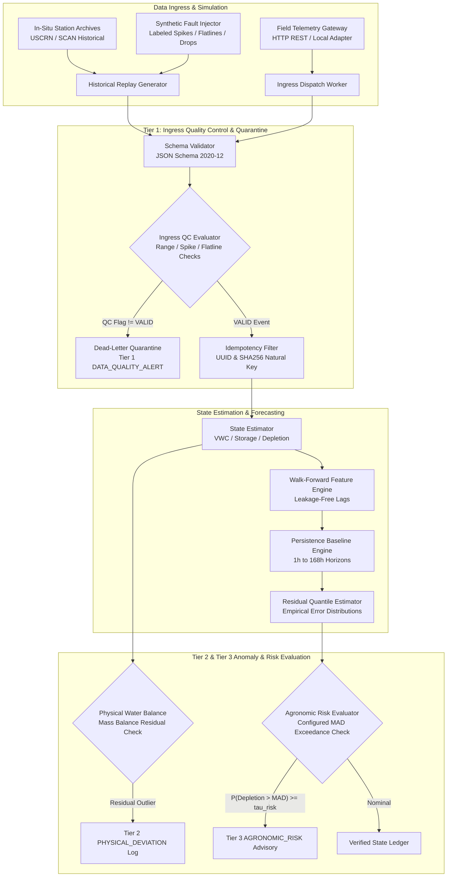

# Agri Telemetry & Forecasting Platform — Technical Specification

**Status:** DECIDED (Architecture & Subsystem Boundaries) / RESEARCHING (Scientific Targets & Calibration)  
**Last Updated:** September 30, 2026  
**Document:** `05_architecture/TECHNICAL_SPEC.md` / `7. Technical Spec/Technical Spec - Agri Telemetry & Forecasting Platform.md`

---

## 1. Executive Summary & Architectural Mission

The **Agri Telemetry & Forecasting Platform** is an event-driven time-series intelligence platform designed to ingest, quality-control, and model in-situ agricultural telemetry, forecast near-term soil-water state trajectories, and evaluate agronomic threshold risks with calibrated uncertainty.

### Core Architectural Principles & Status:
1. **Evidence-Driven Simplicity (`DECIDED`):** In strict conformance with **Rule #18** (*"Keep the simplest architecture that satisfies demonstrated requirements"*), **Rule #15**, and **ADRs 002/003/005**, the platform operates as a modular, lightweight Python service utilizing direct in-memory and local queue dispatch. Distributed message brokers (Kafka, RabbitMQ) and heavy cloud clusters are explicitly deferred.
2. **Strict Chronological Decoupling (`DECIDED`):** Event time (`event_time`) is strictly decoupled from ingestion time (`ingest_time`). Feature construction and model backtesting enforce chronological walk-forward boundaries to prevent future data leakage (**Rule #6, #8, #9**).
3. **Three-Tier Anomaly Isolation (`DECIDED`):** Sensor faults and telemetry corruptions (Tier 1) are quarantined at ingress and are architecturally prohibited from escalating into crop-stress or agronomic alerts (**Rule #12**).
4. **Mandatory Persistence Benchmark (`DECIDED`):** All forecasting models are benchmarked against an empirical persistence baseline under out-of-sample walk-forward evaluation (**Rule #7**, **ADR-004**).
5. **Non-Actuating Advisory Support (`DECIDED`):** The system provides probabilistic risk quantification and operational decision support; it never executes autonomous irrigation actuation.
6. **Scientific Target & Parameter Configurability (`CONFIGURABLE` / `RESEARCHING`):** Agronomic thresholds (e.g. Management Allowable Depletion), soil physical bounds, and mathematical state representations are site-configurable parameters rather than hard-coded universal constants (**Rule #14**).

---

## 2. High-Level Architecture & Topology

---

## 3. Subsystem Breakdown

### 3.1 Ingestion & Transport Subsystem
- **Transport Architecture (`DECIDED`):** HTTP/1.1 REST (`POST /api/v1/telemetry/events`) and direct in-process batch dispatch. Edge protocols (e.g. MQTT) are treated as external ingress adapter gateways, not internal core message buses (**ADR-002**).
- **Serialization & Contract (`DECIDED`):** JSON payloads strictly adhering to [`telemetry-event.schema.json`](schemas/telemetry-event.schema.json).
- **Temporal Handling (`DECIDED`):** Station observation timestamp is preserved in `event_time` (ISO 8601 UTC). System reception timestamp is recorded in `ingest_time`. Chronological ordering and feature windows depend strictly on `event_time`.

### 3.2 Tier 1 Quality Control Engine
- **Taxonomic Separation (`DECIDED`):** Telemetry errors are tagged as `DATA_QUALITY_ALERT` and routed to dead-letter quarantine. They do not enter the forecasting state pipeline (**Rule #12**).
- **Heuristic QC Rules (`ASSUMPTION` / `CONFIGURABLE`):**
  - *Range Check:* Default physical bounds for volumetric water content (VWC $\in [0.0, 0.65]\text{ m}^3/\text{m}^3$) and soil temperature ($T_{\text{soil}} \in [-20^\circ\text{C}, 50^\circ\text{C}]$). *Note: Maximum saturation bound depends on site-specific porosity and is configurable.*
  - *Spike Filter:* Single-interval step changes exceeding $|\Delta \text{VWC}| > 0.15\text{ m}^3/\text{m}^3\text{/hr}$ without recorded precipitation are flagged as `SUSPECT_SPIKE`.
  - *Flatline Detector:* Static invariant float values persisting over $\ge 12\text{ consecutive hours}$ in dynamic meteorological conditions are flagged as `SUSPECT_STUCK`.

### 3.3 State Estimation & Agronomic Transformations
- **State Representation (`RESEARCHING`):** As defined in `DATA_SCIENTIFIC_SPEC.md` Section 4, the definitive target state (point VWC vs. root-zone storage vs. depletion fraction vs. available water fraction) is subject to ongoing target-stability evaluation.
- **Multi-Depth Integration (`ASSUMPTION` / `CONFIGURABLE`):**
  - Effective root-zone volumetric water content ($\theta_{\text{rz}}$) is estimated via layer-weighted depth integration:
    $$\theta_{\text{rz}}(t) = \sum_{i=1}^N w_i \cdot \theta_i(t), \quad \sum w_i = 1.0$$
  - Working baseline assumes probe depths at $5\text{cm}, 10\text{cm}, 20\text{cm}, 50\text{cm}, 100\text{cm}$ where available from USCRN stations.
- **Depletion Formulation (`ASSUMPTION`):**
  $$D_r(t) = \frac{\theta_{\text{FC}} - \theta_{\text{rz}}(t)}{\theta_{\text{FC}} - \theta_{\text{WP}}}$$
  where $\theta_{\text{FC}}$ (Field Capacity) and $\theta_{\text{WP}}$ (Permanent Wilting Point) are site soil hydraulic parameters (`CONFIGURABLE`).

### 3.4 Forecasting & Uncertainty Engine
- **Mandatory Baseline (`DECIDED`):** Persistence baseline $\hat{Y}_{t+h|t} = Y_t \quad \forall h \in [1, 168\text{ hours}]$ (**Rule #7**, **ADR-004**).
- **Diurnal Persistence Baseline (`ASSUMPTION`):** 24-hour seasonal cycle persistence for periodic meteorological variables ($ETo$, solar radiation).
- **Uncertainty Construction (`RESEARCHING`):** Evaluates empirical residual quantile distributions from walk-forward validation splits to construct quantiles ($q_{10}, q_{25}, q_{50}, q_{75}, q_{90}$) and 80% prediction intervals $[q_{10}, q_{90}]$. Parametric assumptions (e.g. Gaussian errors) are not assumed without empirical validation (**Rule #11**).

### 3.5 Risk & Advisory Engine
- **Non-Universal Thresholds (`DECIDED`):** Management Allowable Depletion ($D_{\text{MAD}}$) and risk probability threshold ($\tau_{\text{risk}}$) are configurable parameters per crop, stage, and soil type (**Rule #14**).
- **Evaluation Heuristic (`ASSUMPTION` / `CONFIGURABLE`):**
  - Exceedance probability: $\mathcal{P}_{\text{risk}}(t+h) = P(D_r(t+h) > D_{\text{MAD}} \mid \mathcal{F}_t)$.
  - Working baseline heuristic generates `AGRONOMIC_RISK` advisory when $\mathcal{P}_{\text{risk}} \ge \tau_{\text{risk}}$ (default: $\tau_{\text{risk}} = 0.75$, $D_{\text{MAD}} = 0.50$).
- **Safety Enforcement (`DECIDED`):** All alert events enforce `is_autonomous_actuation: false`.

---

## 4. Execution Runtime, Operational Architecture & Persistence Strategy

- **Configuration Management (`DECIDED` / `IMPLEMENTED`):** Typed dataclass hierarchy (`AppConfig`) cleanly decoupling scientific hydraulic parameters (`SoilConfig`, `RiskConfig`, `ForecastingConfig`) from operational deployment settings (`StreamingConfig`, `ObservabilityConfig`, `StorageConfig`, `MLOpsConfig`, `ReliabilityConfig`). Supports declarative YAML profiles (`config/default.yaml`, `config/production.yaml`) with `AGRI_*` environment variable overrides (**ADR-008**).
- **Operational Observability & Tracing (`DECIDED` / `IMPLEMENTED`):** Structured JSON logging (`agri_telemetry/observability/logging.py`) with standard context fields (`correlation_id`, `run_id`, `stage`, `service`, `environment`), sub-millisecond stage duration tracing (`trace_stage`), and dual-domain metrics collection isolating operational throughput/latencies (p50/p90/p95/p99) from scientific forecast skill/depletion metrics (**ADR-008**).
- **MLOps Lifecycle & Lineage Tracking (`DECIDED` / `IMPLEMENTED`):** Unified `ExperimentTracker` (`agri_telemetry/mlops/experiment_tracker.py`) recording Git commit SHA, dataset metadata, hyperparameters, random seeds, split windows, metrics, and serialized `manifest.json` artifacts per run with pluggable MLflow adapter support (**ADR-008**).
- **Event-Driven Streaming Architecture (`DECIDED` / `IMPLEMENTED`):** Abstract `EventStreamBroker` interface with zero-dependency `InMemoryStreamBroker` for deterministic verification and production `RedisStreamBroker` (`XADD`, `XREADGROUP`, `XACK`). Decoupled `TelemetryStreamWorker` consumes telemetry, enforces Draft 2020-12 schema validation, builds states, generates forecasts, evaluates advisories, and publishes downstream events (**ADR-008**).
- **State & Deduplication (`DECIDED` / `IMPLEMENTED`):** In-memory and SQLite cache utilizing `event_id` and natural composite key $\text{SHA256}(\text{source\_id} \mathbin{\Vert} \text{event\_time} \mathbin{\Vert} \text{data\_class} \mathbin{\Vert} \text{schema\_version})$.
- **Container Topology & CI/CD (`DECIDED` / `IMPLEMENTED`):** Minimal multi-stage Python 3.11-slim container (`Dockerfile`, `docker-compose.yml`, `.dockerignore`) with non-root execution (`appuser:10001`) and automated GitHub Actions workflow (`.github/workflows/ci.yml`) enforcing code formatting, test suites, and bit-for-bit reproducibility checks (**ADR-008**).

---

## 5. Failure Modes, Fault Tolerance & Mitigations

| Failure Mode | Category | Detection Mechanism | Platform Mitigation & Recovery Guarantee | Status |
| :--- | :--- | :--- | :--- | :---: |
| **Poison / Corrupt Payload** | Telemetry Ingestion | JSON Schema Draft 2020-12 validator | Quarantines payload to `DeadLetterQueue` (`runs/dead_letter_queue.jsonl`) with full diagnostic exception trace; pipeline continues without stalling. | `IMPLEMENTED` |
| **Duplicate Transmission** | Ingestion Transport | Natural key / UUID collision | `EventDeduplicator` hash filter suppresses duplicate processing idempotently without state mutation. | `IMPLEMENTED` |
| **Late / Inverted Packet Arrival** | Telemetry Ingestion | `ingest_time - event_time > tolerance` | `OutOfOrderSequencer` buffers sliding window and flushes in strict chronological `event_time` order. | `IMPLEMENTED` |
| **Model Inference Failure** | Forecasting Engine | Model exception / inference timeout | `ResilientForecastRouter` catches downstream error and safely falls back to deterministic Persistence Baseline (B0), guaranteeing advisory continuity. | `IMPLEMENTED` |
| **Sensor Flatline / Freeze** | Data Quality | QC Flatline Filter ($\ge 12\text{h}$ static) | Tag `SUSPECT_STUCK`, route to dead-letter quarantine, hold prior valid state, emit `DATA_QUALITY_ALERT`. | `IMPLEMENTED` |
| **Temporal Data Leakage** | Forecasting / Features | Chronological timestamp assertion | Walk-forward splits abort pipeline on feature timestamps $t > t_{\text{origin}}$. | `IMPLEMENTED` |
| **False Agronomic Alarms** | Anomaly Classification | 3-Tier isolation + Persistence filter | Ingress QC failures are blocked from reaching the risk evaluator; $k=2$ persistence suppresses transient flutter. | `IMPLEMENTED` |

